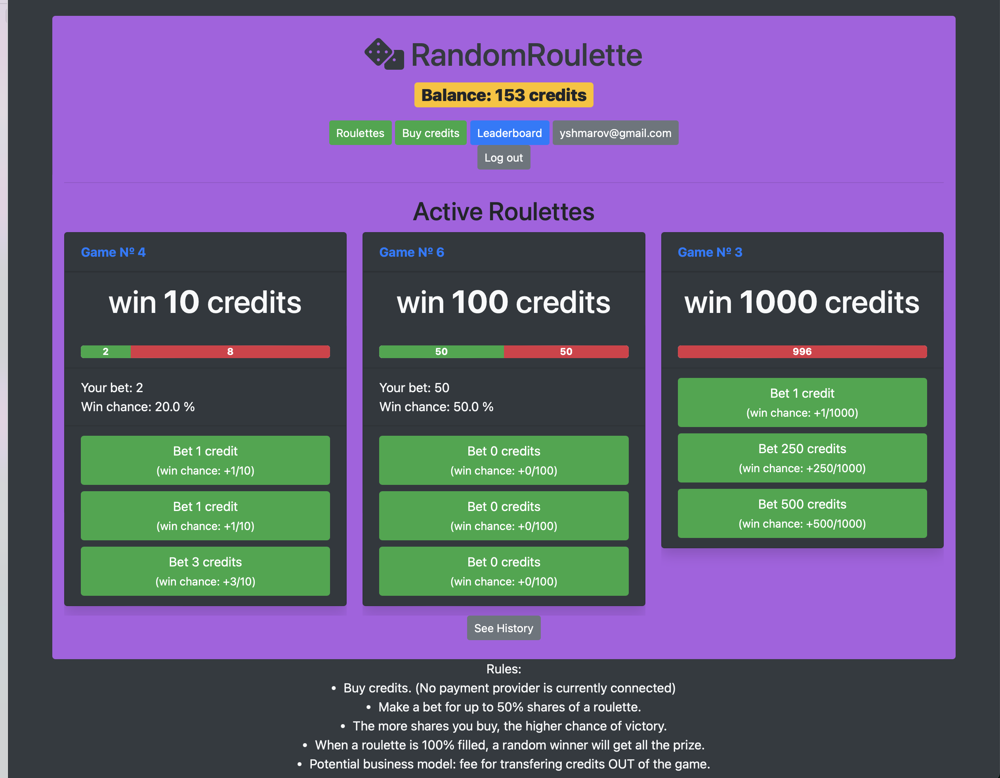
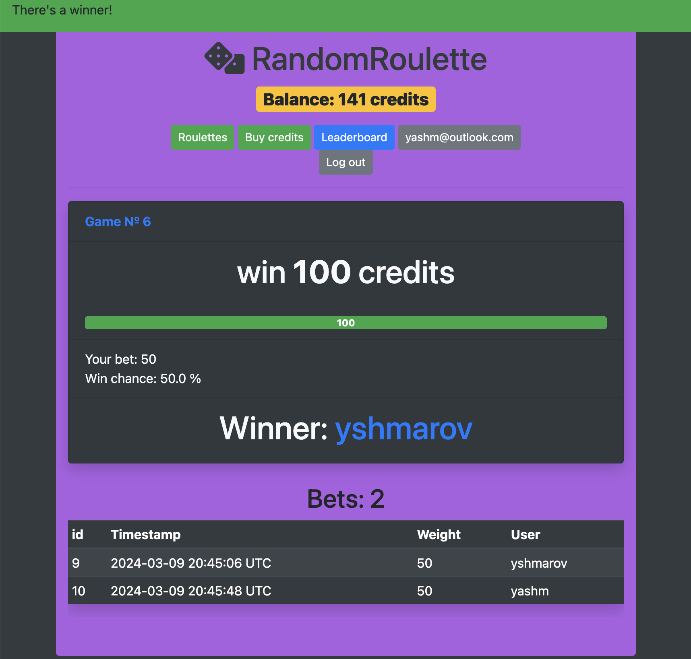
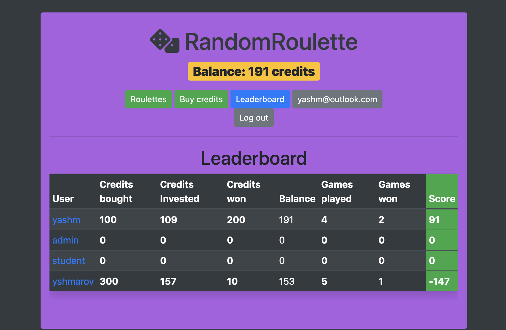

# RandomRoulette - Ruby on Rails 6 lottery application. Buy lottery tickets and win credits!

### Features
* user authentication with Github, Google (not via email)
* buy in-game credits
* buy tickets in a Roulette
* when a Roulette gets filled, *weighted random winner* gets whole prize
* leaderboard - who won the most

### Tech stack

* Ruby 2.7
* Rails 6
* Webpacker
* Bootstrap 4

### Examples:

Make a bet

There's a winner!

Leaderboard

